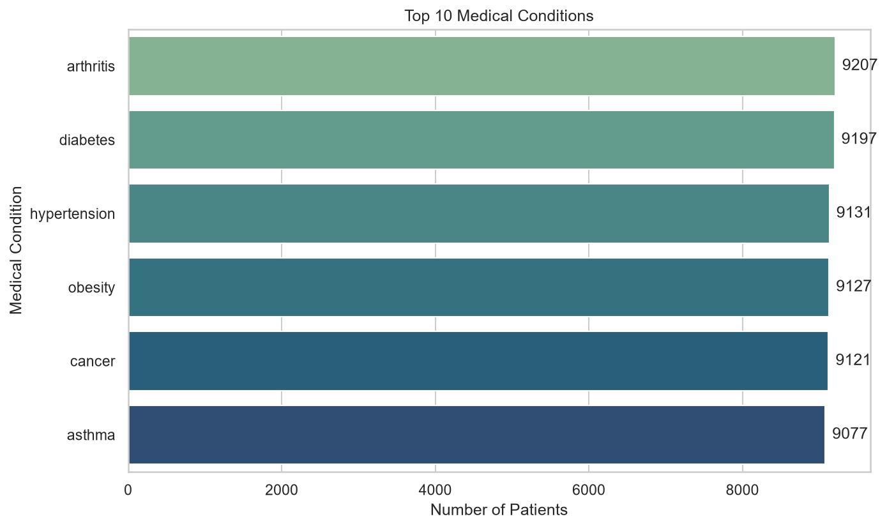
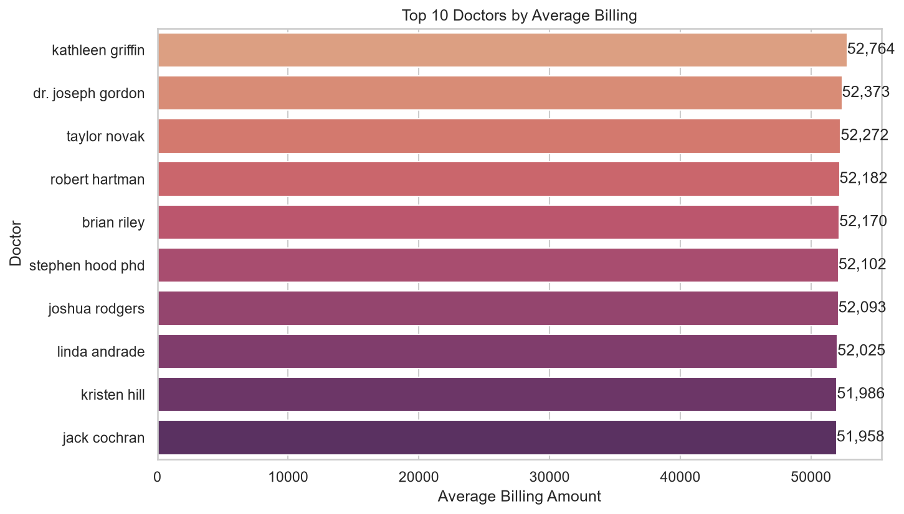
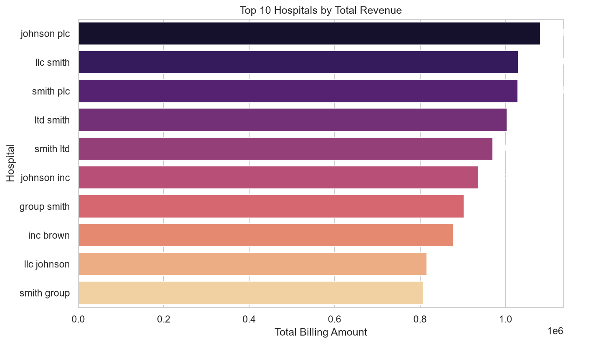
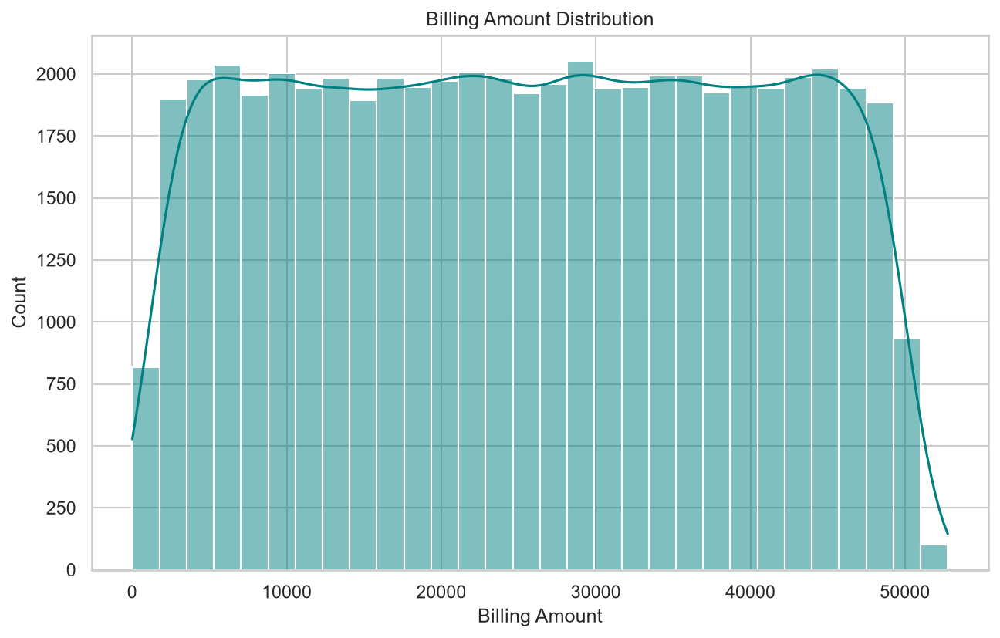
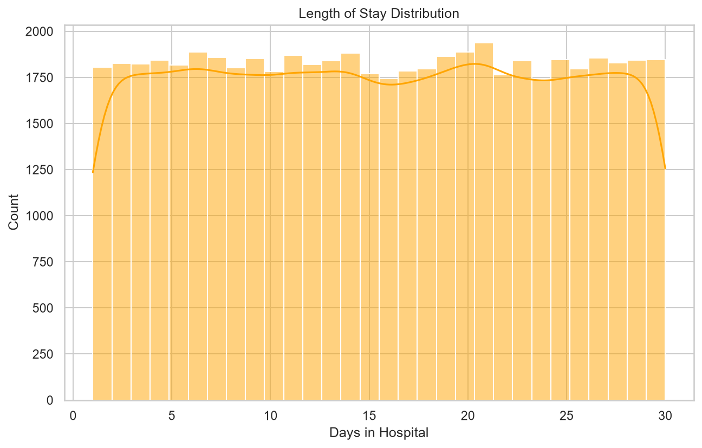
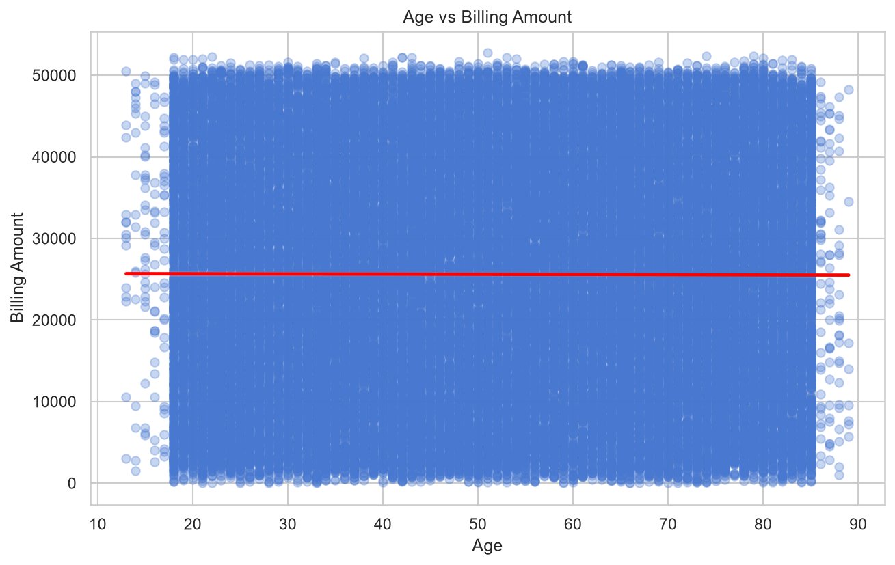

# Healthcare Data Analytics Project

End-to-end healthcare data analytics project built using Python, SQL, and data visualization tools — covering the full pipeline from raw data to actionable insights.

## 📊 Project Overview

This project analyzes a healthcare dataset (54,860+ patient records after cleaning) to uncover insights about medical conditions, billing patterns, doctor/hospital performance, and patient length of stay.

## 🛠️ Tools & Technologies

- **Python**: Pandas, NumPy, Matplotlib, Seaborn
- **Database**: MySQL (via SQLAlchemy)
- **Data Source**: Excel/CSV (Kaggle healthcare dataset)
- **Export**: Excel (openpyxl)

## 🔄 Project Workflow

1. **Data Cleaning** (Python/Pandas)
   - Removed duplicate rows (~536 rows)
   - Removed rows with invalid (negative) billing amounts (106 rows)
   - Standardized column names and text formatting
   - Converted date columns to proper datetime format

2. **Database Design & Load** (MySQL)
   - Normalized data into 2 tables: `patients` and `admission`
   - Loaded cleaned data into MySQL using SQLAlchemy

3. **SQL Analysis**
   - Wrote 6 queries covering JOINs, GROUP BY, subqueries, and date functions
   - Identified top doctors/hospitals by revenue and average billing

4. **Python Analysis**
   - Pulled data back into Python using `pd.read_sql()`
   - Used NumPy to calculate length-of-stay statistics (mean, median, std dev)

5. **Data Visualization** (Matplotlib/Seaborn)
   - 6 charts covering medical conditions, doctor/hospital billing, and distributions

6. **Excel Export**
   - Exported a multi-sheet summary report (`healthcare_analysis_summary.xlsx`)

## 🔍 Key Insights

- Most common medical condition: **arthritis** (9,207 patients) — though all 6 conditions are nearly equal in count (~9,000-9,200), suggesting a synthetically balanced dataset rather than real-world disease prevalence
- Highest revenue doctor (by total billing): **Michael Smith**; most expensive doctor (by average billing): **Kathleen Griffin** (~$52,764 avg) — showing total revenue and per-patient cost are two distinct insights
- Highest revenue hospital: **Johnson PLC**, generating over $1M in total billing
- Average length of stay: **15.5 days** (median: 15.0 days)
- No correlation found between patient age and billing amount (confirmed by a flat trend line in the scatter plot), and both billing amount and length of stay were uniformly distributed — strong evidence this is a synthetically generated dataset rather than real-world skewed healthcare data

## 📈 Visualizations

### Top 10 Medical Conditions

All conditions are nearly equally represented, reinforcing the synthetic/balanced nature of the dataset.

### Top 10 Doctors by Average Billing

The top 10 doctors by average billing are all clustered tightly between ~$52,000-$52,800, showing no single outlier doctor.

### Top 10 Hospitals by Total Revenue

Johnson PLC leads in total revenue generated across all admissions.

### Billing Amount Distribution

Billing amounts are nearly uniformly distributed from $0 to $50,000, unlike typical real-world healthcare billing which tends to be right-skewed.

### Length of Stay Distribution

Length of stay is also uniformly distributed between 1 and 30 days, consistent with the billing distribution pattern.

### Age vs Billing Amount

The flat trend line confirms there is no meaningful relationship between a patient's age and their billing amount.

## 📁 Files in this Repository

- `main.py` — full Python pipeline (cleaning, MySQL load, analysis, visualization, Excel export)
- `healthcare_dataset.csv` — raw dataset
- `SQL File For Healthcare Project.sql` — SQL queries used for analysis
- `healthcare_analysis_summary.xlsx` — final exported summary report
